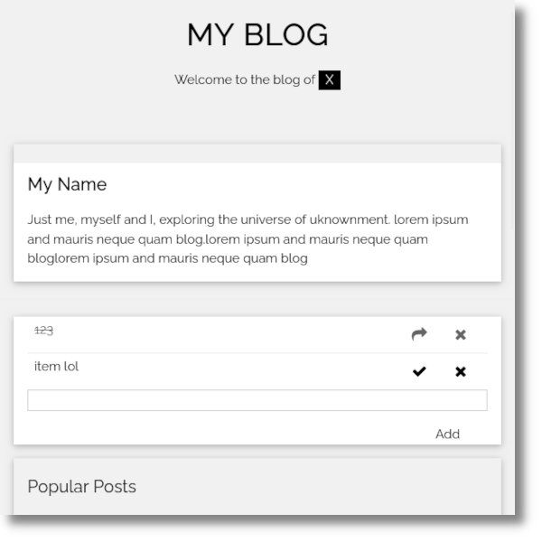

# Dockerize
This is your first task in out assignment. Here you are supposed to build a Dockfile with a Go Webserver within.

**Dockerize** is the first task in the [Stack.io's](https://stack.io) test assignment.

It contains a simple webserver application written in Go which serves a thin client web application that implements a very basic blog.

## Objective

The main objective is to simulate a real world scenario to prepare the application for deployment.

Specifically, this task encompasses:
* Create a `Dockerfile`;
  * Build `golang` executable inside the `Dockerfile`;
  * Let the executable run as the image is loaded;
* Build a `Docker` image using the `Dockerfile`;
* Run the new created image and get a `200` HTTP Code once the container is running;

## Getting Started

1. Clone this repo
2. Enter the folder `dockerize`
3. Run `make`
4. Browse the deployed app at `http://localhost:8080`

